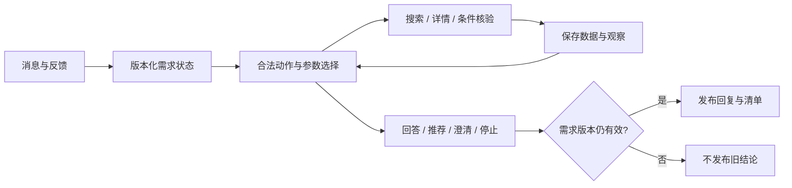

# Job Agent · 对话式求职助手

Job Agent 是一个本地运行的对话式求职助手，帮助你减少反复搜索、打开职位描述和比较岗位的工作。告诉它想找什么工作，再通过追问和反馈调整结果；候选岗位、推荐理由和原始依据会保存在同一个工作区。

## 核心能力

- **持续理解你的要求**：区分必须满足的条件、偏好和个人背景，修改薪资或城市时保留其他要求。
- **根据反馈继续找岗**：利用已有信息回答追问，需要更多依据时再检索或读取职位详情。
- **看懂岗位的取舍**：说明值得考虑的原因、主要顾虑和待确认事项，附上职位描述（JD）中的依据与原始链接。
- **追问已有候选**：可以问“第三个岗位要求什么经验”，也可以暂停任务，稍后继续。
- **集中管理求职信息**：左侧切换会话，中间聊天，右侧比较岗位和查看完整JD。

例如，先说“找北京的前端正式岗位”，再补充“月薪至少15k，双休”。助手会保留前端方向，按新条件重新检查候选；如果已读JD没有说明休息制度，会提示双休仍需核实。

## 安装与启动

需要 **Python 3.12+** 和 [uv](https://docs.astral.sh/uv/getting-started/installation/)。下载仓库后，在项目根目录执行：

```bash
uv sync --locked
uv run job-agent serve
```

打开终端提示的地址，默认 <http://127.0.0.1:7860>，按界面引导配置模型与数据来源。

没有uv时，可创建Python虚拟环境并执行 `python -m pip install -e .`，再运行 `job-agent serve`。

## 首次使用

打开左侧「使用设置与连接」：

1. **模型**：选择Qwen或DeepSeek并保存API Key。密钥保存在本机，调用费用由对应模型服务收取。
2. **数据**：选择实时BOSS、腾讯官网或自己的岗位快照。
3. **连接BOSS（选择实时BOSS时）**：点击准备采集组件，选择Chrome/Edge/Chromium，在助手专用浏览器中本人扫码并检查登录。
4. 回到聊天，表达需求，再通过追问或反馈调整结果。

**无需浏览器插件。** 没有Chrome可以使用Edge或通过界面下载独立Chromium；不能使用桌面浏览器时，可以选择腾讯官网或导入自己的岗位。

|数据来源|需要什么|范围|
|---|---|---|
|实时BOSS|模型API、采集组件、兼容桌面浏览器、本人登录|BOSS搜索取得的岗位|
|腾讯官网|模型API和网络|腾讯公开招聘职位，无需浏览器或登录|
|本地快照|模型API和自己的标准岗位JSON|文件中的岗位，不访问招聘平台|

```bash
uv run job-agent --db workspace/tencent.sqlite serve --source tencent
uv run job-agent --db workspace/boss.sqlite serve --source boss-cdp
uv run job-agent --db workspace/imported.sqlite serve --source snapshot --jobs /path/to/jobs.json
```

习惯使用环境变量时，也可复制 [.env.example](.env.example) 为本地 `.env` 配置模型。详细操作见[首次使用](docs/guides/first-run.md)、[模型配置](docs/guides/model.md)和[BOSS接入](docs/guides/boss-cdp.md)。

## 工作机制



模型负责理解需求、分析岗位和选择下一步行动。程序负责校验工具参数、比较城市和薪资等明确条件，并控制预算与任务状态。每次修改需求都会产生新版本，较早任务返回的结果不会覆盖最新要求；岗位原文与匹配结论分开保存，便于重新核验和追溯。

采用 **Python、Pydantic、SQLite、OpenAI兼容SDK和Gradio**，由单个Agent在明确的执行循环中完成任务。具体机制见[架构说明](docs/design/architecture.md)。

## 使用前了解

- 助手用于检索、阅读和比较；投递与招聘者沟通由你自行完成。
- 浏览器接入受页面变化、网络、登录和平台验证影响。实际验证过Windows Chrome / WSL桥接；其他系统提供检测与配置路径，尚未全部完成端到端验证。
- 搜索只覆盖本次取得的岗位。模型可能误解JD，重要条件应结合原始链接核实；推荐不代表符合全部资格或保证录用。
- 模型费用按返回用量和本地配置估算，不等于官方账单；示例费率应按服务实际报价更新。
- 会话、岗位和配置保存在本地；使用云模型时，需求和用于分析的岗位内容会发送给你配置的模型服务。

## 目录与开发

```text
src/job_agent/   Agent、状态、模型通信、岗位接入和界面
tests/          核心代码的单元测试
docs/           安装、配置和机制说明
workspace/      本地运行数据与凭据（Git忽略）
```

```bash
uv sync --locked --extra dev
uv run pytest -q
uv run ruff check src tests
```

上述测试使用临时数据和模拟接口，无需招聘账号或模型密钥。参与开发见 [CONTRIBUTING.md](CONTRIBUTING.md)。

自研代码采用 [MIT License](LICENSE)，第三方接入说明见 [THIRD_PARTY_NOTICES.md](THIRD_PARTY_NOTICES.md)。招聘内容不属于本项目MIT授权范围。文档入口：[docs/README.md](docs/README.md)。
